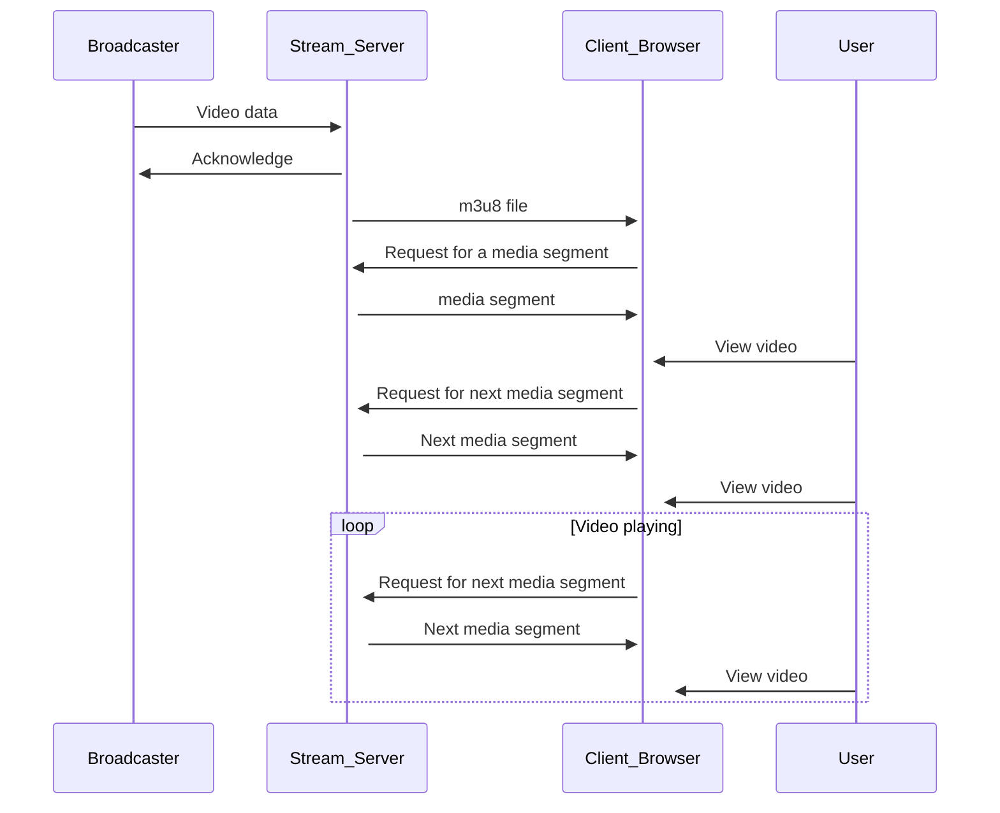

HLS(HTTP Live Streaming)는 Apple Inc.에서 개발한 미디어 스트리밍 프로토콜입니다. 이 프로토콜은 iOS 및 macOS 기기에서 널리 사용되며, 라이브 및 비디오 on demand(온디맨드) 컨텐츠를 제공합니다.

HLS는 비디오 및 오디오 컨텐츠를 작은 세그먼트 파일로 분할하여 전송합니다. 세그먼트 파일은 일반적으로 약 2-10초의 길이를 가지며, 여러 해상도와 대역폭에 대한 선택지를 제공합니다. 이러한 세그먼트 파일의 위치는 m3u8 파일을 사용하여 전달됩니다.

## m3u8 파일

m3u8 파일은 Apple의 HTTP Live Streaming(HLS) 프로토콜에서 사용되는 텍스트 파일입니다. 이 파일은 라이브 스트림에서 세그먼트 파일의 위치를 지정하는 데 사용됩니다. m3u8 파일은 일련의 세그먼트를 포함하며, 각 세그먼트 파일의 위치를 지정합니다. 이러한 세그먼트 파일의 위치는 일정한 시간 간격으로 업데이트됩니다.

m3u8 파일은 클라이언트가 지속적으로 세그먼트 파일을 다운로드할 수 있도록 세그먼트의 길이, 위치 및 비디오 해상도와 같은 정보를 포함합니다. 이러한 정보를 사용하여 클라이언트는 적절한 비디오 해상도와 대역폭을 선택하고, 세그먼트 파일을 다운로드하여 비디오를 재생합니다.

## 라이브 방송에서의 HLS

라이브 방송에서는 새로운 세그먼트가 지속적으로 생성됩니다. 이에 따라, Stream Server는 일정한 시간 간격으로 m3u8 파일을 업데이트하고, 새로운 세그먼트 파일의 위치를 추가합니다. Client Browser는 폴링 방식을 사용하여 일정한 시간 간격으로 m3u8 파일을 요청하고, 새로운 세그먼트 파일의 위치를 추출하여 다운로드합니다.

Client Browser는 세그먼트를 수신하고 비디오를 재생하는 루프를 반복하여 지속적으로 라이브 방송의 세그먼트를 수신하고 비디오를 시청할 수 있습니다. 이러한 과정은 아래와 같습니다.

다이어그램에서는 Broadcaster가 비디오 데이터를 Stream Server에 보내고, Stream Server는 m3u8 파일을 Client Browser에 보내며, 클라이언트는 m3u8 파일을 통해 비디오 세그먼트를 요청하고 수신하는 과정을 보여줍니다. User는 클라이언트에서 비디오를 시청하는 역할을 합니다.

다이어그램에서는 클라이언트가 비디오를 시청하는 동안 비디오 세그먼트를 지속적으로 요청하고 수신하는 것을 볼 수 있습니다. 클라이언트는 세그먼트를 수신하고 비디오를 재생하는 루프를 반복합니다. 이러한 과정을 통해 클라이언트는 지속적으로 라이브 방송의 세그먼트를 수신하고 비디오를 시청할 수 있습니다.

## 결론

HLS는 다양한 플랫폼에서 호환되며, 대역폭 및 화질 조정과 같은 다양한 기능을 제공하여 사용자가 원하는 방식으로 비디오를 시청할 수 있습니다. 또한, m3u8 파일을 사용하여 세그먼트 파일의 위치를 전달하므로, 클라이언트는 새로운 세그먼트를 지속적으로 수신할 수 있습니다.

개발자는 HLS를 구현하기 위해 다양한 라이브러리와 도구를 사용할 수 있습니다. hls.js, Shaka Player, Video.js 및 JW Player와 같은 라이브러리는 자바스크립트 기반으로 작성되어 있으며, 브라우저에서 HLS 스트리밍을 자동으로 처리하고 비디오 플레이어를 제공합니다.

이러한 라이브러리를 사용하면 HLS 스트리밍을 간편하게 구현할 수 있습니다. 그러나 라이브러리에 대한 이해와 함께 HLS 스트리밍에 대한 이해도 중요합니다. 이를 통해 더 효율적이고 안정적인 HLS 스트리밍 구현이 가능해집니다.