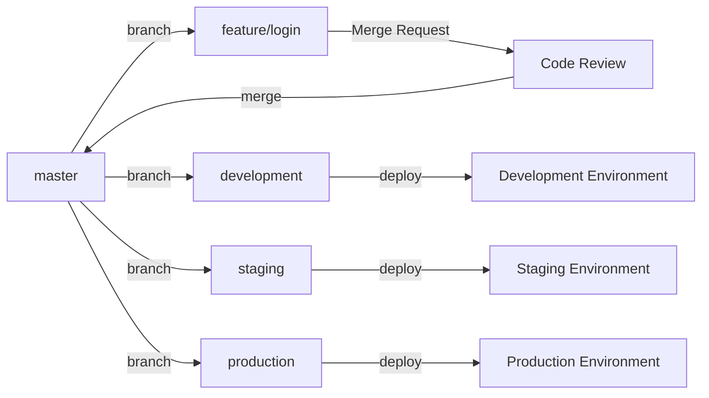

{.align-center}

버전 관리 시스템인 Git을 사용하는 프로젝트에서 개발, 협업, 배포를 돕는 세 가지 작업 흐름, Git Flow, GitHub Flow, 그리고 GitLab Flow에 대해 알아보고 예시를 통해 각각의 흐름을 설명합니다.

## Git Flow

Vincent Driessen이 제안한 브랜치 전략으로, 큰 규모의 프로젝트에 적합하고 명확한 구조를 제공합니다.

> **Vincent Driessen**
>
> Vincent Driessen은 소프트웨어 개발자로, 주로 Python 및 웹 기술을 다룹니다. 그는 Git Flow라는 인기 있는 브랜치 전략을 제안한 것으로 알려져 있습니다. 이 전략은 규모가 큰 프로젝트에서 릴리스와 유지 관리를 효과적으로 관리하는 데 도움이 됩니다. 그의 아이디어는 Git의 브랜치 모델을 활용하여 명확한 구조를 제공하며, 여러 개발자들이 협업을 원활하게 진행할 수 있게 돕습니다.

### 주요 구성 요소
- master: 안정적인 버전의 코드가 저장되는 브랜치로, 모든 릴리스 버전은 이 브랜치에서 태그로 표시됩니다.
- develop: 개발 중인 코드가 저장되는 브랜치로, 새로운 기능이 여기에 병합됩니다.
- feature branches: 각각의 새로운 기능을 개발하는 데 사용되는 브랜치로, develop 브랜치에서 파생되고 완료되면 다시 병합됩니다.
- release branches: 새로운 릴리스를 준비하는 데 사용되는 브랜치로, develop 브랜치에서 파생되며 버그 수정 등의 작업이 이루어집니다. 준비가 완료되면 master와 develop 브랜치에 병합됩니다.
- hotfix branches: 긴급한 버그 수정을 위한 브랜치로, master 브랜치에서 파생되며 수정 후 master와 develop 브랜치에 병합됩니다.

### Git Flow 예시

```mermaid
graph LR
  A[master] -->|branch| B[develop]
  B -->|branch| C[feature/login]
  C -->|merge| B
  B -->|branch| D[release/1.0.0]
  D -->|merge| A
  D -->|merge| B
  A -->|branch| E[hotfix/1.0.1]
  E -->|merge| A
  E -->|merge| B
 ```
 
## GitHub Flow
GitHub Flow는 Git Flow보다 간소화된 프로세스로, 빠른 개발 사이클을 가진 프로젝트에 적합합니다.

> **GitHub**
> 
> GitHub은 2008년에 설립된 웹 기반의 호스팅 서비스로, Git을 사용하는 소스 코드 버전 관리를 제공합니다. 프로젝트를 호스팅하고 관리하는 데 사용되며, 개발자들이 협업하고 코드를 공유하는 데 도움이 됩니다. 또한 이슈 트래커, 풀 리퀘스트, 코드 리뷰 등의 기능을 제공하여 개발 프로세스를 향상시킵니다. GitHub은 오픈 소스 및 상업용 프로젝트 모두에서 널리 사용되며, 개인 및 기업 사용자를 대상으로 다양한 서비스와 통합 기능을 제공합니다.

### 주요 구성 요소
- master: 안정적인 코드가 저장되는 브랜치로, 여기서부터 새로운 브랜치가 생성됩니다.
- feature branches: 각 기능이 개발되는 브랜치로, master 브랜치에서 파생되고 완료되면 다시 병합됩니다. Pull Request를 통해 코드 리뷰와 토론이 이루어집니다.
- deployment: master 브랜치로 병합된 코드는 즉시 배포됩니다.

### GitHub Flow 예시

```mermaid
graph LR
  A[master] -->|branch| B[feature/login]
  B -->|Pull Request| C[Code Review]
  C -->|merge| A
  A -->|deploy| D[Deployment]
```

## GitLab Flow

GitLab Flow는 Git Flow와 GitHub Flow의 장점을 결합한 유연한 브랜치 전략으로, 다양한 환경에서 코드를 배포하고 관리하는 데 사용됩니다.

> **GitLab**
> 
> GitLab은 소프트웨어 개발 및 DevOps의 전체 수명주기를 지원하는 웹 기반의 Git 리포지토리 관리 시스템입니다. GitLab은 코드 저장소, 이슈 트래커, CI/CD 파이프라인, 아티팩트 관리 등 다양한 기능을 제공합니다. GitLab은 오픈 소스 버전과 무료 및 유료의 자체 호스팅 버전으로 제공되며, 소규모 프로젝트부터 대형 기업까지 다양한 규모의 프로젝트에 사용할 수 있습니다. GitLab Flow는 이러한 환경에서 제공되는 브랜치 전략 중 하나로, 유연한 작업 흐름을 제공합니다.

### 주요 구성 요소

- master: 안정적인 코드가 저장되는 브랜치로, 여기서부터 새로운 브랜치가 생성됩니다.
- feature branches: 각 기능이 개발되는 브랜치로, master 브랜치에서 파생되고 완료되면 다시 병합됩니다. Merge Request를 통해 코드 리뷰와 토론이 이루어집니다.
- environment branches: 개발, 스테이징, 프로덕션과 같은 다양한 환경에서 코드를 배포하고 관리하는 데 사용되는 브랜치입니다. 환경 브랜치는 master 브랜치로부터 파생되며, 적절한 환경에 코드를 배포할 때 사용됩니다.
- release branches (선택 사항): Git Flow와 유사하게 릴리스 브랜치를 사용할 수 있습니다. 이러한 브랜치는 릴리스 준비를 위해 생성되며, 준비가 완료되면 master 브랜치에 병합됩니다.
- hotfix branches (선택 사항): 긴급한 버그 수정을 위한 브랜치로, master 브랜치에서 파생되며 수정 후 master와 관련된 환경 브랜치에 병합됩니다.

### GitLab Flow 예시


세 가지 흐름 모두의 목표는 소프트웨어 개발과 배포를 원활하게 진행하는 것입니다. 각 흐름은 프로젝트의 규모, 요구 사항, 그리고 팀 구성에 따라 선택하고 적용할 수 있습니다. Git Flow는 복잡한 프로젝트와 릴리스 관리에 더 적합하며, GitHub Flow는 간단하고 빠른 프로젝트에 적합하고, GitLab Flow는 유연성과 환경 관리를 중시하는 프로젝트에 적합합니다.

이러한 작업 흐름 중 하나를 선택할 때, 팀 구성원들과 함께 현재 프로젝트의 요구 사항과 미래의 가능성을 고려하여 결정을 내리는 것이 중요합니다. 이를 통해 프로젝트의 성공적인 진행과 원활한 협업을 도모할 수 있습니다.

각 브랜치 전략을 사용하여 원활한 개발 및 배포 과정을 구축할 수 있습니다. 이를 통해 프로젝트의 생산성을 높이고 협업을 원활하게 할 수 있습니다. 이제 각 브랜치 전략에 대해 이해하고, 프로젝트에 적합한 전략을 선택하여 효과적으로 사용해보세요.


> **Q. GitHub Flow, GitLab Flow와 같이 특정 서비스를 연상시키는 네이밍이 생긴 이유는 무엇입니까?**
> 
> GitHub Flow와 GitLab Flow의 이름이 해당 서비스와 연관된 이유는 각각의 브랜치 전략이 해당 서비스에서 제공하는 기능 및 협업 도구와 잘 연동되기 때문입니다. 각 서비스에서 제안된 브랜치 전략은 해당 서비스의 사용자들이 해당 플랫폼에서 프로젝트를 더 효과적으로 관리하고 협업하는 데 도움을 주는 것을 목표로 합니다.
> 
> - **GitHub Flow**: GitHub에서 사용되는 기능과 도구, 특히 풀 리퀘스트와 코드 리뷰 시스템과 밀접하게 연관되어 있습니다. GitHub Flow는 간단하고 명료한 브랜치 전략으로, 프로젝트의 빠른 개발 사이클과 지속적인 배포에 초점을 맞추고 있습니다. 이 전략은 GitHub에서의 협업 및 코드 리뷰 프로세스와 잘 맞아떨어지기 때문에, 이러한 이름이 붙여졌습니다.
> 
> - **GitLab Flow**: GitLab에서 제공하는 기능과 도구, 특히 Merge Request 및 CI/CD 파이프라인과 밀접하게 연관되어 있습니다. GitLab Flow는 유연한 브랜치 전략으로, 다양한 환경에서의 배포와 관리를 중시합니다. 이 전략은 GitLab 플랫폼의 기능을 최대한 활용하여 높은 수준의 유연성과 프로젝트 관리를 제공하려고 하기 때문에, 이러한 이름이 붙여졌습니다.
> 
> 결국, 브랜치 전략의 이름이 특정 서비스를 연상시키는 이유는 해당 전략이 그 서비스의 특성 및 기능에 기반하여 개발되고 최적화되었기 때문입니다. 이러한 브랜치 전략을 사용함으로써 해당 서비스를 사용하는 개발자들은 프로젝트를 더 효율적으로 관리하고 협업할 수 있습니다.


