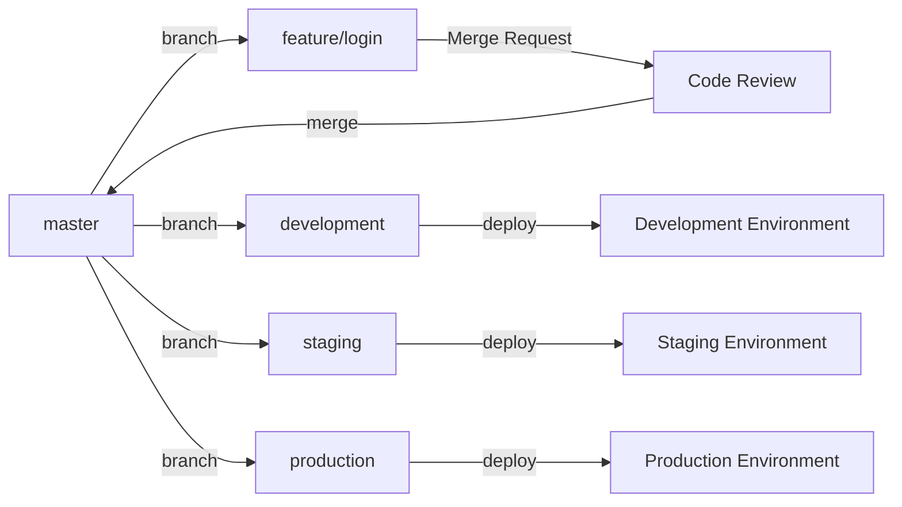

# Git Flow, GitHub Flow, GitLab Flow 비교와 예제

버전 관리 시스템인 Git을 사용하는 프로젝트에서 개발, 협업, 배포를 돕는 세 가지 작업 흐름, Git Flow, GitHub Flow, 그리고 GitLab Flow에 대해 알아보고 예시를 통해 각각의 흐름을 설명합니다.

## Git Flow

Vincent Driessen이 제안한 브랜치 전략으로, 큰 규모의 프로젝트에 적합하고 명확한 구조를 제공합니다.

### 주요 구성 요소
- master: 안정적인 버전의 코드가 저장되는 브랜치로, 모든 릴리스 버전은 이 브랜치에서 태그로 표시됩니다.
- develop: 개발 중인 코드가 저장되는 브랜치로, 새로운 기능이 여기에 병합됩니다.
- feature branches: 각각의 새로운 기능을 개발하는 데 사용되는 브랜치로, develop 브랜치에서 파생되고 완료되면 다시 병합됩니다.
- release branches: 새로운 릴리스를 준비하는 데 사용되는 브랜치로, develop 브랜치에서 파생되며 버그 수정 등의 작업이 이루어집니다. 준비가 완료되면 master와 develop 브랜치에 병합됩니다.
- hotfix branches: 긴급한 버그 수정을 위한 브랜치로, master 브랜치에서 파생되며 수정 후 master와 develop 브랜치에 병합됩니다.

### Git Flow 예시

```mermaid
graph LR
  A[master] -->|branch| B[develop]
  B -->|branch| C[feature/login]
  C -->|merge| B
  B -->|branch| D[release/1.0.0]
  D -->|merge| A
  D -->|merge| B
  A -->|branch| E[hotfix/1.0.1]
  E -->|merge| A
  E -->|merge| B
 ```
 
## GitHub Flow
GitHub Flow는 Git Flow보다 간소화된 프로세스로, 빠른 개발 사이클을 가진 프로젝트에 적합합니다.

### 주요 구성 요소
- master: 안정적인 코드가 저장되는 브랜치로, 여기서부터 새로운 브랜치가 생성됩니다.
- feature branches: 각 기능이 개발되는 브랜치로, master 브랜치에서 파생되고 완료되면 다시 병합됩니다. Pull Request를 통해 코드 리뷰와 토론이 이루어집니다.
- deployment: master 브랜치로 병합된 코드는 즉시 배포됩니다.

### GitHub Flow 예시

```mermaid
graph LR
  A[master] -->|branch| B[feature/login]
  B -->|Pull Request| C[Code Review]
  C -->|merge| A
  A -->|deploy| D[Deployment]
```

## GitLab Flow

GitLab Flow는 Git Flow와 GitHub Flow의 장점을 결합한 유연한 브랜치 전략으로, 다양한 환경에서 코드를 배포하고 관리하는 데 사용됩니다.

### 주요 구성 요소

- master: 안정적인 코드가 저장되는 브랜치로, 여기서부터 새로운 브랜치가 생성됩니다.
- feature branches: 각 기능이 개발되는 브랜치로, master 브랜치에서 파생되고 완료되면 다시 병합됩니다. Merge Request를 통해 코드 리뷰와 토론이 이루어집니다.
- environment branches: 개발, 스테이징, 프로덕션과 같은 다양한 환경에서 코드를 배포하고 관리하는 데 사용되는 브랜치입니다. 환경 브랜치는 master 브랜치로부터 파생되며, 적절한 환경에 코드를 배포할 때 사용됩니다.
- release branches (선택 사항): Git Flow와 유사하게 릴리스 브랜치를 사용할 수 있습니다. 이러한 브랜치는 릴리스 준비를 위해 생성되며, 준비가 완료되면 master 브랜치에 병합됩니다.
- hotfix branches (선택 사항): 긴급한 버그 수정을 위한 브랜치로, master 브랜치에서 파생되며 수정 후 master와 관련된 환경 브랜치에 병합됩니다.

### GitLab Flow 예시


세 가지 흐름 모두의 목표는 소프트웨어 개발과 배포를 원활하게 진행하는 것입니다. 각 흐름은 프로젝트의 규모, 요구 사항, 그리고 팀 구성에 따라 선택하고 적용할 수 있습니다. Git Flow는 복잡한 프로젝트와 릴리스 관리에 더 적합하며, GitHub Flow는 간단하고 빠른 프로젝트에 적합하고, GitLab Flow는 유연성과 환경 관리를 중시하는 프로젝트에 적합합니다.

이러한 작업 흐름 중 하나를 선택할 때, 팀 구성원들과 함께 현재 프로젝트의 요구 사항과 미래의 가능성을 고려하여 결정을 내리는 것이 중요합니다. 이를 통해 프로젝트의 성공적인 진행과 원활한 협업을 도모할 수 있습니다.

각 브랜치 전략을 사용하여 원활한 개발 및 배포 과정을 구축할 수 있습니다. 이를 통해 프로젝트의 생산성을 높이고 협업을 원활하게 할 수 있습니다. 이제 각 브랜치 전략에 대해 이해하고, 프로젝트에 적합한 전략을 선택하여 효과적으로 사용해보세요.