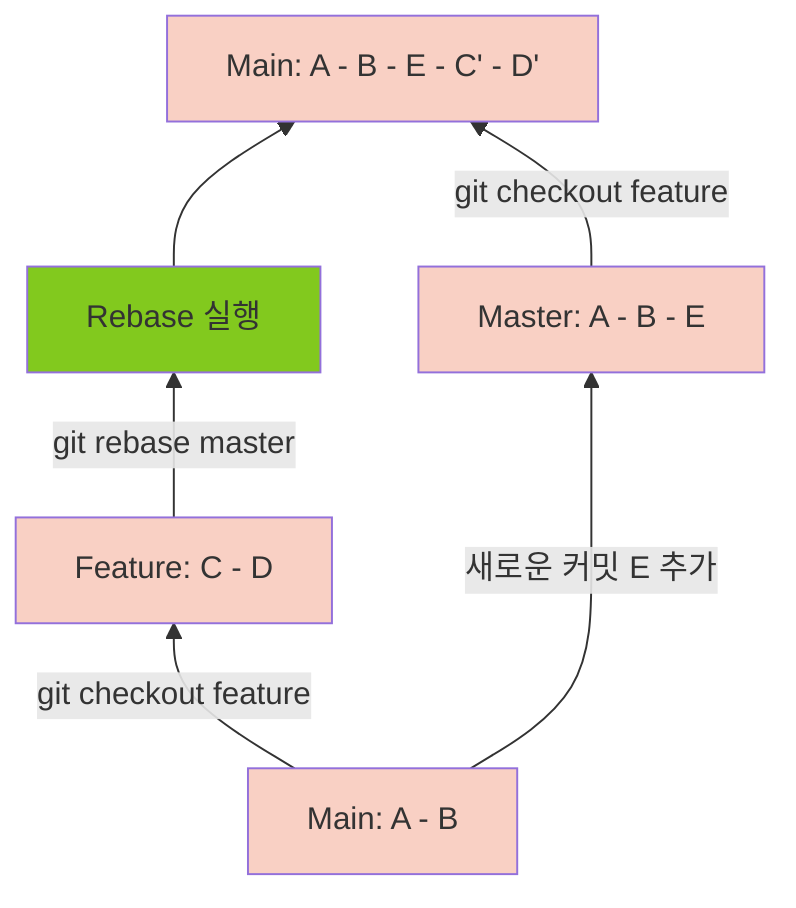

# Git Rebase

Git Rebase는 개발자가 브랜치를 새 기본 커밋으로 이동하여 브랜치 기록을 효과적으로 다시 작성할 수 있는 강력한 도구입니다. 이는 지저분한 기록을 정리하거나 여러 분기의 변경 사항을 통합하는 데 유용할 수 있습니다. 그러나 Rebase는 충돌을 일으키고 버그를 추적하기 어렵게 만들 수도 있습니다. Rebase를 신중하고 신중하게 사용하는 것이 중요합니다.

## Git Rebase를 사용 방법

Rebase를 수행하려면 먼저 현재 HEAD가 Rebase하려는 브랜치를 체크 아웃 했는지 확인해야합니다. 그런 다음 다음 명령을 사용합니다.

```
git rebase <new-base>
```

여기서 `<new-base>`는 브랜치의 새 기반으로 설정하려는 커밋입니다. 이렇게 하면 브랜치가 새 기본 커밋으로 이동하고 분기 기록이 다시 작성됩니다.

## Rebase 예제

Main 브랜치에서 분기된 Feature 브랜치에서 작업 중이라고 가정해 보겠습니다. 이 기능에 대해 작업하는 동안 Main 브랜치에 몇 가지 변경 사항이 적용되었습니다. 이제 이러한 변경 사항을 Feature 브랜에 통합하려고 합니다.

이를 위해 Git rebase를 사용할 수 있습니다. 먼저 Feature 브랜치로 전환합니다.

```
git checkout feature-branch
```

그런 다음 Rebase를 수행합니다.

```
git rebase main
```

이렇게 하면 Feature 브랜치가 Main 브랜치의 헤드로 이동하고 브랜치 기록이 다시 작성됩니다. Feature 브랜치에서 변경한 사항은 Main 브랜치의 변경 사항 위에 적용됩니다.




Rebase가 성공하면 Feature 분기를 Main 분기로 다시 병합할 수 있습니다. 그러나 리베이스 중에 충돌이 있으면 병합하기 전에 해결해야 합니다.

> - Rebase는 강력한 도구일 수 있지만 위험할 수도 있습니다. 브랜치 기록을 다시 작성하고 충돌을 일으키고 버그 추적을 어렵게 만들 수 있습니다.
> - 공유 브랜치를 리베이스하면 다른 팀 구성원에게 혼동을 일으키고 문제를 일으킬 수 있습니다.
> - Rebase는 신중하게 사용해야 하며, 공유 브랜치를 Rebase하기 전에 다른 팀원들과 소통하는 것이 좋습니다.

{.align-center}