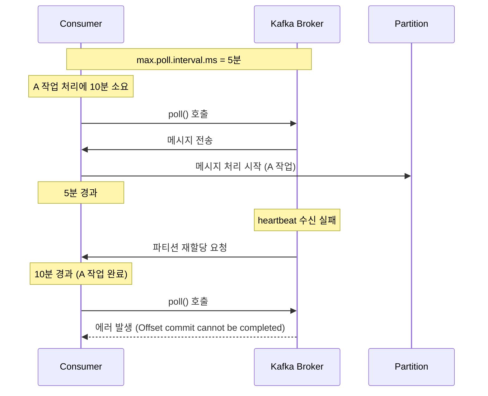

Kafka 컨슈머 그룹에서 발생하는 "Offset commit cannot be completed" 에러는 파티션 할당과 관련된 문제입니다. 이 글에서는 에러 발생 원인과 해결 방법을 설명합니다.

## 에러 발생 원인

Kafka 컨슈머 그룹에서 파티션 할당은 컨슈머 그룹 내에서 균등하게 이루어집니다. 컨슈머의 `max.poll.interval.ms` 설정 값은 컨슈머가 poll() 메서드를 호출하고 Kafka 브로커로부터 heartbeat를 받는 주기를 의미합니다. 만약 컨슈머가 `max.poll.interval.ms` 값을 초과하여 poll() 메서드를 호출하지 못하면, Kafka 브로커는 해당 컨슈머가 죽은 것으로 판단하게 됩니다. 이러한 상황을 방지하기 위해서는 적절한 `max.poll.interval.ms` 값을 설정하거나, 다른 방법들을 고려해야 합니다.

### 문제 상황 예시

A 작업이 처리되는 동안에 Kafka 컨슈머, 브로커 등의 동작을 좀 더 자세히 살펴보겠습니다. A 작업 처리에는 10분이 소요되지만, 컨슈머의 `max.poll.interval.ms` 설정 값이 5분으로 설정되어 있습니다. 이로 인해 다음과 같은 상황이 발생합니다.

- 컨슈머가 작업을 시작하면서 poll() 메서드를 호출합니다. 이때, Kafka 브로커로부터 메시지를 가져오고 처리를 시작합니다.
- A 작업 처리에는 10분이 걸리므로, 컨슈머는 다음 poll() 메서드 호출까지 `max.poll.interval.ms` 값을 5분 초과하는 시간 동안 작업을 수행합니다.
- 이 시간 동안, 컨슈머는 Kafka 브로커에게 heartbeat를 보내지 않습니다. 그러면 Kafka 브로커는 해당 컨슈머가 죽은 것으로 판단하고, 해당 컨슈머의 파티션을 다른 컨슈머에게 재할당하게 됩니다.
- 컨슈머가 A 작업을 완료한 후, 다시 poll() 메서드를 호출하려고 시도하지만, 이미 파티션을 잃어버렸기 때문에 "**Offset commit cannot be completed since the consumer is not part of an active group for auto partition assignment; it is likely that the consumer was kicked out of the group.**" 에러가 발생하게 됩니다.

## 해결 방안

1. **`max.poll.interval.ms` 값 조정**: A 작업을 처리하는데 필요한 시간이 `max.poll.interval.ms` 값을 초과하는 경우, `max.poll.interval.ms` 값을 증가시키면 됩니다. 하지만 이 경우에는 컨슈머가 poll() 메서드를 호출하는 빈도가 낮아져, Kafka 브로커와의 heartbeat 지연이 발생할 수 있으므로, 적절한 값으로 설정해야 합니다.

2. **컨슈머 인스턴스 추가**: 컨슈머 인스턴스를 추가하여, 파티션 할당을 분산시킬 수 있습니다. 이렇게 하면 각 컨슈머 인스턴스는 더 적은 파티션을 처리하게 되므로, 처리 시간이 긴 작업이 발생해도 다른 파티션의 메시지를 처리할 수 있습니다.

3. **다른 방법 고려**: Kafka 컨슈머 그룹 내에서 파티션 할당이 균등하게 이루어지고, 처리 시간이 긴 작업을 분산시킬 수 있는 다른 방법들을 고려할 필요가 있습니다. 예를 들어, 병렬 처리나 스트리밍 처리 등 다양한 방법이 있습니다.

## 결론

Kafka 컨슈머 그룹에서 발생하는 문제를 해결하기 위해서는, 컨슈머의 설정 값을 적절히 조정하고, 파티션 할당을 균등하게 분산시키는 등의 방법을 고려해야 합니다. 이를 통해 데이터 처리 속도를 향상시키고, 데이터 유실을 방지할 수 있습니다. 컨슈머 그룹의 성능을 최적화하기 위해 다양한 방법을 시도해보고, 적합한 방법을 찾아 적용하시길 바랍니다.
